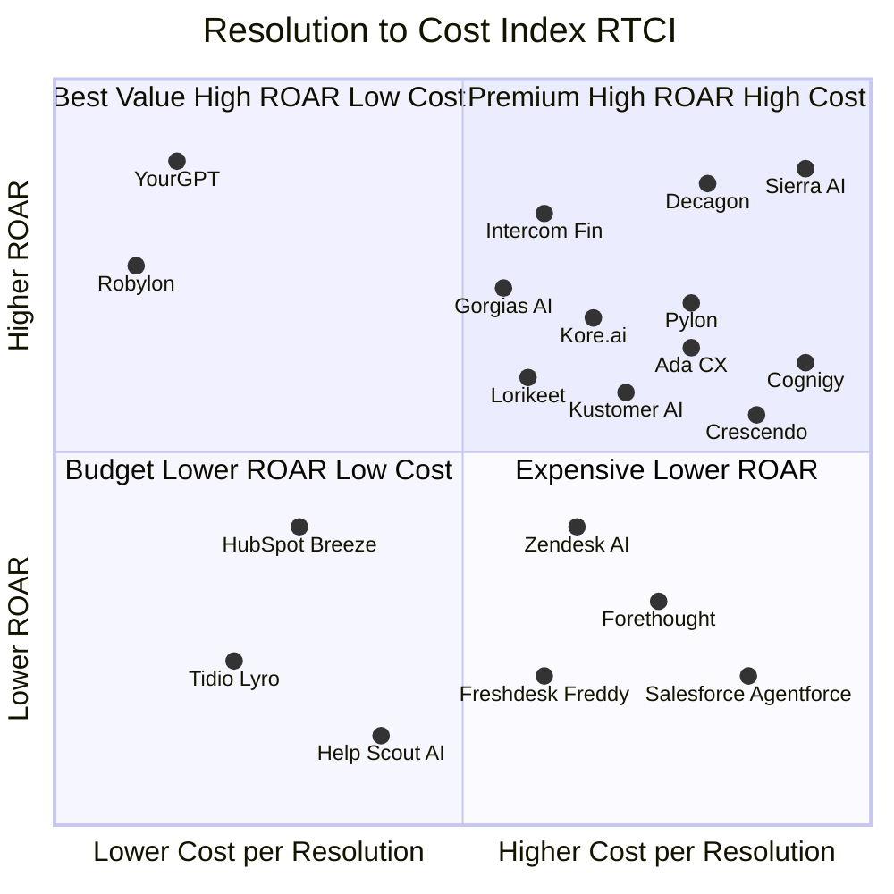
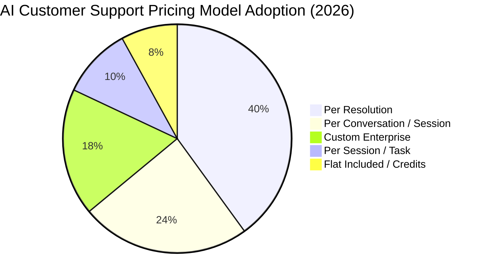

<div align="center">

# 🤖 Resolution-to-Cost Index (RTCI)

### The Definitive Benchmark for AI Customer Support Platforms

**Ranking the 20 most credible AI support tools on the only two metrics that actually matter: real resolution rate vs. real cost per resolution.**

[](https://andrewhall07.github.io/ai-support-pricing-index/) [](#master-comparison) [](#pricing-models-decoded) [-orange)](#market-snapshot) [](#editorial-independence) [](https://creativecommons.org/licenses/by/4.0/)

*Last verified: **July 2026** · Maintained as a living document · No vendor paid for placement or ranking — see [Editorial Independence & Disclosure](#editorial-independence)*

**Website:** [andrewhall07.github.io/ai-support-pricing-index](https://andrewhall07.github.io/ai-support-pricing-index/)

</div>

---

## Table of Contents

* [Index Snapshot](#index-snapshot)
* [Methodology](#how-this-index-was-built)
* [Top 20 Master Comparison](#master-comparison)
* [Tier Rankings](#tier-rankings)
* [Cost Components Breakdown](#cost-components-breakdown)
* [Decision Matrix](#decision-matrix)
* [Sources & References](#sources-references)

---

<a id="how-this-index-was-built" name="how-this-index-was-built"></a>

## 🧪 How This Index Was Built

1. **Sources** — official vendor pricing pages, independent teardowns, G2/Capterra reviews, Gartner sources and named customer case studies.
2. **Claimed rates** come directly from vendor marketing, case studies, or public dashboards.
3. **Realistic ROAR** discounts claimed rates for ticket complexity, knowledge-base maturity, and deployment discipline.
4. **True cost per resolution** includes AI fees, required seats, double-billing, platform minimums, onboarding, and overage.
5. **RTCI tier** is calculated only from realistic ROAR and aggregate cost per AI-resolved ticket. Transparency, time-to-value, and trust are reported separately and never change the numerical tier.

> **⚠️ Read This Before Using the Table** Vendor resolution numbers are **not independently audited**. Treat them as ceilings, not baselines. The "Realistic ROAR" column is our conservative, adjusted estimate for a mid-market deployment with average knowledge-base quality.

---

<a id="trust-summary" name="trust-summary"></a>

### ✅ Research Transparency & Disclosure

| What                                | Detail                                                                                                                                                                                |
| ----------------------------------- | ------------------------------------------------------------------------------------------------------------------------------------------------------------------------------------- |
| **Primary sources used**            | Vendor pricing pages, vendor documentation, named customer case studies                                                                                                               |
| **Secondary sources used**          | Independent procurement teardowns (Macha, MyAskAI, Dirr, CorePiper, Coworker AI, Resolve247, ZPlatform, GetMacha) — cross-checked against primary sources, never used alone            |
| **Not used**                        | Anonymous forum posts, unverified social claims, vendor-commissioned "independent" reports                                                                                            |
| **Sponsorship**                     | None. No platform paid for inclusion, ranking position, or tier placement                                                                                                             |
| **Estimates vs. confirmed figures** | Explicitly labeled per platform — see the **Data Confidence** column in the master table                                                                                              |
| **Update cadence**                  | Re-verified whenever pricing pages change materially; flagged as "living index" throughout                                                                                            |

---

<a id="editorial-independence" name="editorial-independence"></a>

### 🔍 Editorial Independence & Disclosure

* **No paid placement.** No platform in this index paid for inclusion, tier assignment, or ranking position. Tiers are derived mechanically from the stated ROAR-to-cost formula, not editorial judgment about brand preference.
* **No affiliate links.** None of the links in this document are affiliate or referral links. They point to vendors' primary marketing and pricing pages, or to independent third-party research.
* **Author is not a vendor.** This index was not produced by, and is not affiliated with, any platform it evaluates.
* **Known limitation:** several enterprise only vendors do not publish pricing. Their figures are third-party estimates, clearly labeled, and should be treated as directional, not contractual.
* **Numbers change fast.** AI support pricing shifted materially multiple times in 2026 alone (see [Market Snapshot](#market-snapshot)). Always reconcile against the vendor's live pricing page before signing.
* **Open and community-maintained.** This index is built entirely from publicly available sources and is released under an open license. Anyone can propose a correction or add a platform that was missed — see [Contributing](#contributing) — and every source is listed in [Sources & References](#sources-references) so claims can be checked independently.

---

<a id="index-snapshot" name="index-snapshot"></a>

### 🏷️ Index Snapshot

| Metric                                | Value                               |
| ------------------------------------- | ----------------------------------- |
| **Platforms indexed**                 | 20 credible, production-grade tools |
| **Pricing verified**                  | July – August 2026                  |
| **AI customer service market**        | ~$15.12B (2026)                     |
| **Human cost per ticket**             | $6 – $15 fully loaded               |
| **True cost per resolution (all-in)** | $0.03 – $3.50+                      |
| **Vendor-claimed resolution range**   | 25% – 90%+                          |
| **Realistic production ROAR**         | 25% – 75%                           |

> **⚠️ Pricing Accuracy Pledge** Every aggregate cost in this index is the **full invoice stack** — base plan, seats, AI add-ons, platform fees, onboarding, and typical overage — not just the headline AI line item. Where vendors hide pricing behind sales, we cite third-party procurement data and mark it clearly as estimated/custom.

---

<a id="what-is-the-rtci" name="what-is-the-rtci"></a>

## 📌 What Is the Resolution-to-Cost Index?

The **Resolution-to-Cost Index (RTCI)** is a single efficiency score that compares AI customer support tools on outcome-per-dollar:

```
RTCI Score = (Realistic Production Resolution Rate) ÷ (True Cost Per Resolution)
```

A higher RTCI means more tickets resolved per dollar spent. It deliberately ignores feature checklists and isolates two hard numbers:

1. **Does it actually close tickets?**
2. **What do you actually pay per closed ticket?**

> **ℹ️ ROAR vs. Deflection** We use **ROAR** — *Resolved on Automation Rate*. A ticket only counts as "resolved" if AI closes it end-to-end with **no human handoff** and **no customer re-contact within 72 hours**. Vendors often report "deflection" instead, which counts customers who simply gave up. ROAR is stricter and much closer to real ROI.

---


### 📐 How ROAR Estimates Are Derived

Discounting a vendor's claimed rate down to a realistic first-deployment number is **inherently subjective** — there's no audited ground truth to check it against. Rather than hide that, here are the five parameters that actually move the number, in the order we weigh them:

| Parameter                                    | What It Signals                                                                                                                        | How It Moves the Estimate                                                                            |
| -------------------------------------------- | -------------------------------------------------------------------------------------------------------------------------------------- | ---------------------------------------------------------------------------------------------------- |
| **Independent reviews & named case studies** | Whether G2/Capterra sentiment and named-customer results back the claim, or only unverified marketing copy exists                      | Verified, named results → smaller discount; marketing-only claims → larger discount                  |
| **Architecture**                             | Whether the AI takes real actions (refunds, order updates, account changes) or only answers questions                                  | Action-taking agents with system integrations → smaller discount; answer-only bots → larger discount |
| **Documentation & definition transparency**  | Whether the vendor publishes exactly what counts as a "resolution" (see [Reading Resolution Numbers](#how-to-read-resolution-numbers)) | Clear, published definitions → smaller discount; vague or undisclosed methodology → larger discount  |
| **Feature maturity**                         | Guardrails, escalation logic, multi-turn handling, and channel coverage                                                                | Mature guardrails and escalation paths → smaller discount; thin feature sets → larger discount       |
| **Deployment time to first resolved ticket** | How quickly a typical team sees real, in-production resolutions (not a sandbox demo)                                                   | Fast, well-documented time-to-value → smaller discount; long, opaque onboarding → larger discount    |

This won't make the estimate objective — two reasonable analysts could land on different numbers from the same five inputs — but it does make the estimate **reproducible**: anyone can check the same five parameters against a platform's public sources and see whether they'd land in a similar range. Disagreements are welcome; see [Contributing](#contributing).

---

<a id="master-comparison" name="master-comparison"></a>

## 🏆 The RTCI Top 20 — Master Comparison

| Row | Platform                  | Best For                        |       Claimed Resolution Rate | Realistic ROAR | Cost Per Resolution (Aggregate)               | Min. Commitment                | Pricing Model                               | Trust |             Data Confidence             |     RTCI Tier    |
| -- | ------------------------- | ------------------------------- | ----------------------------: | -------------: | --------------------------------------------- | ------------------------------ | ------------------------------------------- | :---: | :-------------------------------------: | :--------------: |
| 1  | **Intercom Fin**          | SaaS / mid-market on Intercom   | 66–76% avg (6K–8K+ customers) |         50–70% | $0.99–$1.84                                   | 1 seat / 50 outcomes           | Per outcome + per seat (+ floor standalone) |  ⭐⭐⭐⭐ |                 🟢 High                 |     ✅ Strong    |
| 2  | **Gorgias AI**            | Shopify / DTC ecommerce         |            60% (vendor claim) |         50–65% | $1.26–$1.50+                                  | Ticket-based plan              | Ticket plan + per-resolution AI add-on      |  ⭐⭐⭐  |                 🟢 High                 |     ✅ Strong    |
| 3  | **YourGPT**               | SMB/Enterprise AI Teams         |        80-90%+ (case studies) |         60–80% | $0.03–$0.30                                   | None                           | Flat plan + AI credits                      |  ⭐⭐⭐⭐ |                🟡 Medium                |     🔥 Elite     |
| 4  | **Robylon**               | High-volume multi-system        |                        70–85% |         60–75% | $0.10–$0.40                                   | None                           | AI credits + optional seats                 |  ⭐⭐⭐⭐ |                🟡 Medium                |     🔥 Elite     |
| 5  | **Sierra AI**             | Enterprise voice + chat         |                 Not published |         50–70% | Custom (~$150K+/yr platform)                  | ~$150K+/yr                     | Outcome-based enterprise                    |   ⭐   | 🔴 Low (quote-only, 3rd-party estimate) |  — Not scored   |
| 6  | **Kore.ai**               | Enterprise bot + contact center |                 Not published |         35–55% | $0.30–$0.60+ per conversation/session         | None (self-serve); custom Ent. | Per conversation/session + seats            |  ⭐⭐⭐  |                🟡 Medium                |  — Not scored   |
| 7  | **Lorikeet**              | Complex support / customer-veto |                        50–60% |         45–60% | $0.80–$1.50+                                  | $1,500/mo annual platform      | Platform fee + resolution credits           |  ⭐⭐⭐⭐ |                🟡 Medium                |  🔥 Elite       |
| 8  | **Pylon**                 | B2B SaaS / technical support    |                 Not published |       Not published | Custom                                      | Contact sales                  | Custom enterprise                           |  ⭐⭐⭐⭐ | 🔴 Low (quote-only; no public ROAR)      |  🔒 Quote-led data    |
| 9  | **HubSpot Breeze**        | HubSpot-native teams            |                 65% (HubSpot) |         35–50% | $0.50 + seat/onboarding                       | Service Pro+ seat              | Per seat + credits per resolution           |  ⭐⭐⭐⭐ |                🟡 Medium                |  — Not scored   |
| 10 | **Help Scout AI**         | Small email-first teams         |                 Not published |         20–35% | $1.00–$1.50+                                  | None                           | Per seat + per resolution                   |  ⭐⭐⭐⭐ |           🟢 High (published)           |   ⚖️ Moderate   |
| 11 | **Decagon**               | Enterprise complex workflows    |      70–90% (named customers) |         55–75% | Custom (~$1.50/res + $50K–$400K+/yr platform) | ~$50K+/yr platform             | Custom enterprise                           |   ⭐   | 🔴 Low (quote-only, 3rd-party estimate) |  — Not scored   |
| 12 | **Kustomer AI**           | DTC / CRM-centric ecommerce     |        40% (Vuori deployment) |         40–55% | $0.60 + $712–$1,112/mo seat floor             | 8 seats                        | Per conversation + per seat                 |  ⭐⭐⭐  |                🟡 Medium                |  — Not scored   |
| 13 | **Zendesk AI**            | Existing Zendesk Suite users    |    25–35% (Zendesk CX Trends) |         40–55% | $1.20–$2.00+                                  | Suite + Copilot                | Per seat + per verified resolution          |   ⭐⭐  |                 🟢 High                 |    ⚖️ Moderate   |
| 14 | **Freshdesk Freddy**      | Budget SMBs on Freshdesk        |           40–60% / 53% retail |         35–45% | $0.40–$1.96                                   | Seat + sessions                | Per seat + per session                      |  ⭐⭐⭐  |                 🟢 High                 |  ⚖️ Moderate   |
| 15 | **Tidio Lyro**            | Micro-SMB ecommerce             |               60–70% in-scope |         30–45% | $0.50–$0.78 + base plan                       | Lyro add-on                    | Per conversation tier + Lyro add-on         |  ⭐⭐⭐  |                🟡 Medium                |  ⚖️ Moderate   |
| 16 | **Crescendo**             | Managed AI + human backup       |         70–90% (vendor claim) |         50–70% | $1.25–$2.99 + $2,900/mo base                  | $2,900/mo base                 | Per resolution + base (managed BPO)         |   ⭐⭐  |                🟡 Medium                | 🔎 Partial public data  |
| 17 | **Ada CX**                | Multilingual / regulated        |                        30–50% |         40–60% | $1.00–$3.50+ est.                             | ~$30K+/yr                      | Custom enterprise                           |   ⭐   | 🔴 Low (quote-only, 3rd-party estimate) |  🔒 Quote-led data   |
| 18 | **Forethought**           | Triage + routing (Zendesk)      |    35–45% / up to 98% (claim) |         35–50% | Custom                                        | ~$40K–$160K/yr                 | Custom enterprise                           |   ⭐   |                  🔴 Low                 |  🔒 Quote-led data   |
| 19 | **Salesforce Agentforce** | Salesforce enterprise ecosystem |                 Not published |         40–55% | $2.00 or $0.10–$0.30/action + platform        | Service Cloud Ent.             | Per conversation/action + platform          |   ⭐⭐  |                🟡 Medium                |  🔎 Partial public data  |
| 20 | **Cognigy**               | Voice-first contact centers     |            Vendor-quoted only |         40–60% | Custom                                        | Enterprise                     | Custom enterprise                           |   ⭐   |                  🔴 Low                 | 🔒 Quote-led data   |

**Data Confidence key:** 🟢 High — vendor publishes exact pricing on its own site · 🟡 Medium — partial public pricing, with a custom or usage-dependent component · 🔴 Low — quote-only; figures are third-party estimates, not vendor-confirmed.

> **ℹ️ How to Read the Cost Column** Where the pricing model permits it, **Cost Per Resolution (Aggregate)** is the effective all-in cost per AI-resolved ticket: base plan, seats, AI add-ons, onboarding, and typical overage included. For rows marked **Not scored**, the cell retains the vendor’s stated usage unit or a custom-price indication instead. Full math per platform lives in [Cost Components Breakdown](#cost-components-breakdown).

### 📊 ROAR vs. Cost — Visual Map

This visual includes only the platforms that receive a numerical tier. It plots realistic ROAR (midpoint) against aggregate cost per resolution (midpoint); it is a visual aid, not a separate ranking method.



---

<a id="tier-rankings" name="tier-rankings"></a>

## 🥇 RTCI Tier Rankings

Tiers below are derived from the master table, not from feature breadth, reputation, or enterprise suitability. For rows with a usable aggregate **cost per AI-resolved ticket**, the provisional score is:

```
RTCI midpoint = midpoint of Realistic ROAR (%) ÷ midpoint of aggregate cost per resolution (USD)
```

The score is shown as **percentage points of ROAR per US dollar**. Tiers are mechanical: **Elite ≥100**, **Strong 40–99**, and **Moderate <40**. A platform is **not scored** when its listed price is per conversation, session, task, or action, when a fixed fee cannot be amortized without a volume assumption, or when the price is quote-only. That is a comparability limitation, not a quality judgment.

### 🔥 Elite Tier — 100+ RTCI points per dollar

| Rank | Platform | Midpoint ROAR | Midpoint Cost | Indicative RTCI | Basis |
| ---: | --- | ---: | ---: | ---: | --- |
| 1 | **YourGPT** | 70.0% | $0.115 | **609** | $0.03–$0.30 aggregate cost per resolution |
| 2 | **Robylon** | 67.5% | $0.20 | **338** | $0.10–$0.40 aggregate cost per resolution |

### ✅ Strong Tier — 40–99 RTCI points per dollar

| Rank | Platform | Midpoint ROAR | Midpoint Cost | Indicative RTCI | Basis |
| ---: | --- | ---: | ---: | ---: | --- |
| 3 | **Intercom Fin** | 60.0% | $1.415 | **42** | $0.99–$1.84 aggregate cost per resolution |
| 4 | **Gorgias AI** | 57.5% | $1.38 | **42** | $1.26–$1.50+ aggregate cost per resolution |

### ⚖️ Moderate Tier — Below 40 RTCI points per dollar

| Rank | Platform | Midpoint ROAR | Midpoint Cost | Indicative RTCI | Basis |
| ---: | --- | ---: | ---: | ---: | --- |
| 5 | **Zendesk AI** | 47.5% | $1.60 | **30** | $1.20–$2.00+ aggregate cost per resolution |
| 6 | **Help Scout AI** | 27.5% | $1.25 | **22** | $1.00–$1.50+ aggregate cost per resolution |

### — Not scored — Price or unit is not comparable from this table

| Platform(s) | Why no RTCI tier is assigned |
| --- | --- |
| **HubSpot Breeze, Kustomer AI, Tidio Lyro, Lorikeet, Crescendo** | The table includes a per-resolution or per-conversation price **plus** seats, onboarding, or a base plan. No ticket volume is provided to amortize those fixed costs. |
| **Kore.ai, Freshdesk Freddy, Salesforce Agentforce** | The stated usage unit is a conversation, session, or action rather than an AI-resolved ticket. Converting it would require an evidence-backed resolution-to-usage ratio. |
| **Pylon, Sierra AI, Decagon, Ada CX, Forethought, Cognigy** | Pricing is quote-only, custom, or incomplete, so the table does not provide a comparable aggregate cost per resolution. |

> **Important:** The positions above are an efficiency ordering of the stated table inputs. They are not an overall product ranking. Low-confidence estimates and ranges with a trailing “+” should be treated as directional until a vendor publishes an auditable all-in cost at a defined ticket volume.

---

<a id="anatomy-of-a-true-cost" name="anatomy-of-a-true-cost"></a>

## 🧬 Anatomy of a True Cost — Why "Aggregate" ≠ the Headline Price

Every vendor advertises one clean number. Almost none of them charge just one number. The **Cost Per Resolution (Aggregate)** column in this index always compounds up to three layers — and the gap between the headline price and the real invoice is usually where budgets break.

**Layer 1 — Fixed platform / seat cost.** A monthly floor you pay whether or not the AI resolves anything: helpdesk seats, platform minimums, or a standalone base fee. **Layer 2 — Variable AI usage.** The advertised per-resolution, per-conversation, or per-credit rate — the number in the marketing headline. **Layer 3 — Add-ons and overage.** Optional modules (analytics, Copilot, outbound), overage penalties once you exceed bundled volume, and double-billing where one automated ticket triggers two separate meters.

> **🔎 Worked Example — Intercom Fin** Fin's headline price is **$0.99 per outcome** (a resolution, handoff, or disqualification), and that figure is accurate — it's exactly what Intercom's outcome-based documentation states. But it is a Layer 2 number only.
>
> | Layer                | What It Adds                                                                                                                                           | Typical Range                      |
> | -------------------- | ------------------------------------------------------------------------------------------------------------------------------------------------------ | ---------------------------------- |
> | 1. Seats             | Advanced/Expert agent seats required for human backup, or a $49/mo base fee (incl. first 50 outcomes) on the standalone "Fin for platforms" deployment | $29–$139/agent/mo, or $49/mo floor |
> | 2. Per-outcome usage | $0.99 per resolution / handoff / disqualification; $9.99 per lead qualification                                                                        | $0.99–$9.99 per outcome            |
> | 3. Add-ons           | Copilot ($29–$35/seat/mo), Pro analytics ($99/mo), Proactive Support Plus ($99/mo)                                                                     | Optional, stacks if enabled        |
>
> A documented real-world case: two agents on Intercom's Advanced plan cost **$198/month fixed**. At 300 Fin resolutions in that month, usage adds **$297**. Total: **$495/month**, which blends out to roughly **$0.50–$1.65 per conversation** depending on ticket mix and channel — not a flat $0.99. That blended range is why this index lists Intercom Fin's aggregate as **$0.99–$1.84**: the low end assumes a lean, high-volume, standalone deployment near the $0.99 floor; the high end reflects a typical seat-plus-usage-plus-add-on stack once Copilot and analytics are switched on.
>
> This is not unique to Intercom — it's the standard shape of AI-support pricing in 2026. Gorgias double-bills a clean automation as both a ticket and an AI interaction ($1.26–$1.50+). Zendesk stacks Suite seats, a $50/seat Copilot fee, and per-resolution charges ($1.20–$2.00+). HubSpot Breeze adds a one-time onboarding fee ($1,500–$3,500) on top of its $0.50/resolution credit rate. **Whenever a vendor's headline number looks unusually low relative to its category, check for a seat floor or add-on layer before comparing it to a flat-rate competitor.**

---

<a id="how-to-read-resolution-numbers" name="how-to-read-resolution-numbers"></a>

## 💡 How to Read the Resolution Numbers

Vendors measure "resolution" differently. Know the definition before comparing across the table:

| Definition                     | What Counts                                     | Typical Vendor    |
| ------------------------------ | ----------------------------------------------- | ----------------- |
| **Confirmed resolution**       | Customer explicitly confirms issue solved       | Decagon, Lorikeet |
| **Assumed resolution**         | Customer stops replying within 24–72h           | Intercom Fin      |
| **Contained / no escalation**  | No human took over the conversation             | Kustomer, Zendesk |
| **Task completed**             | AI action executed (refund, order update, etc.) | YourGPT, Gorgias  |
| **Vendor dashboard aggregate** | Internal metric, definition unclear             | Ada, Forethought  |

> **💡 The Rule of Thumb** Divide any vendor's claimed rate by ~15–25% to approximate realistic first-deployment ROAR. A claimed 80% usually lands at 55–65% in production unless you already have a mature knowledge base and tight escalation rules.

---

<a id="pricing-models-decoded" name="pricing-models-decoded"></a>

## 💰 Pricing Models Decoded

| Model                             | How It Bills                            | Best For                            | Hidden Risk                                                 | Example Tools                                               |
| --------------------------------- | --------------------------------------- | ----------------------------------- | ----------------------------------------------------------- | ----------------------------------------------------------- |
| **Per Resolution (outcome)**      | Pay only when AI resolves end-to-end    | Most buyers; aligns cost with value | Bill spikes as AI improves; definition varies by vendor     | Intercom Fin, Gorgias AI Agent, Lorikeet                    |
| **Per Conversation / Session**    | Pay for every AI touch, resolved or not | Forecasting predictability          | Wastes ~30–60% of spend on failed interactions              | Kustomer, Freshdesk Freddy, Salesforce Agentforce, Kore.ai  |
| **Flat + Credits**                | Fixed plan + token/credit pool          | Predictable high-volume teams       | Heavy models burn credits faster; seat fees may still apply | YourGPT, Robylon                                            |
| **Per Seat + Usage**              | Base seat fee + AI usage add-on         | Teams locked into a helpdesk        | Three stacked layers: seat + AI add-on + per-outcome meter  | Zendesk AI, Help Scout AI, Freshdesk Freddy, HubSpot Breeze |
| **Platform Fee + Per Resolution** | Monthly platform minimum + overage      | High-volume regulated teams         | High floor; overage falls with volume                       | Lorikeet, Crescendo                                         |
| **Custom Enterprise**             | Quote-only contracts                    | Large regulated orgs                | Opaque, long procurement cycles                             | Decagon, Sierra, Ada, Forethought, Cognigy                  |

---

<a id="cost-components-breakdown" name="cost-components-breakdown"></a>

## 🧾 Cost Components Breakdown

Stacked layers behind every aggregate number: base platform/seat cost, AI/usage cost, and the hidden fees most buyers miss.

### Cost Stack — Resolution-Based Price Ranges

| Platform         | Base / Platform Cost                                                     | AI / Usage Cost                                                                      | Hidden Fees & Overage                                                | Aggregate Calculation                                            |
| ---------------- | ------------------------------------------------------------------------ | ------------------------------------------------------------------------------------ | -------------------------------------------------------------------- | ---------------------------------------------------------------- |
| **Intercom Fin** | Seat: $29–$139/agent/mo; or standalone floor: $49/mo                     | $0.99 per outcome/resolution                                                         | Copilot $29–$35, Pro analytics $99, outbound $99                     | $0.99 + seat amortization + floor → **$0.99–$1.84**              |
| **YourGPT**      | Flat plan: $39–$349/mo incl. 10M–100M AI credits + 3–20 members          | No separate AI fee                                                                   | Extra members $10; credit add-ons $7/2M credits                      | Flat fee ÷ conversation volume → **$0.03–$0.30**                 |
| **Gorgias AI**   | Helpdesk: $10–$900/mo incl. 50–5,000 tickets; overage $0.36–$0.40/ticket | AI Agent: $30–$477/mo incl. 30–530 interactions; extra AI $0.90–$1.00, $1.50 overage | **Double-billing**: an AI resolution also consumes a billable ticket | $0.90 AI + ~$0.36 ticket ≈ **$1.26–$1.50+** per clean automation |
| **Robylon**      | Workspace: $0–$180/mo incl. 300–4,500+ AI credits                        | Credits consumed per AI turn/action                                                  | Extra credits $25/1,000; optional live seats $19–$89                 | Credit cost per resolution → **$0.10–$0.30**                     |
| **Sierra AI**    | Custom platform fee, typically ~$150K–$350K/yr                           | Outcome-based per resolution                                                         | Enterprise implementation & ongoing tuning                           | Custom — model as six-figure annual minimum                      |

### Cost Stack — Mixed or Partially Comparable Pricing

| Platform           | Base / Platform Cost                                                      | AI / Usage Cost                                                                           | Hidden Fees & Overage                                                                    | Aggregate Calculation                                  |
| ------------------ | ------------------------------------------------------------------------- | ----------------------------------------------------------------------------------------- | ---------------------------------------------------------------------------------------- | ------------------------------------------------------ |
| **Kore.ai**        | Self-serve: ~$50–$150/mo tiers; Enterprise custom                         | Standard: $0.20/conversation; Enterprise: per 15-min session + agent seats                | Voice Gateway billed separately; support add-on ~$1,000/mo; enterprise $300K+/yr typical | Self-serve **$0.20–$0.60+**; Enterprise custom         |
| **Lorikeet**       | Start: $1,500/mo ($18K/yr); Scale: $4,000/mo ($48K/yr); Enterprise custom | Chat/email/SMS: 0.80–0.95 credits; Voice: 1.20–1.50 credits; Routing/QA: 0.25–0.30/ticket | Annual commitment required; no self-serve trial; credits prepaid                         | Platform fee ÷ volume + credit cost → **$0.80–$1.50+** |
| **Pylon**          | Custom quote                                                              | Custom quote                                                                                | Pricing and volume commitments are not public                                            | Custom — quote required                                  |
| **HubSpot Breeze** | Pro $90–$100/seat/mo or Ent. $150/seat/mo + $1,500–$3,500 onboarding      | 50 HubSpot Credits per resolved conv (~$0.50)                                             | Credit overage $0.010/credit; shared credit pool; 72-hr reopen can double-charge         | $0.50/conv + seat + onboarding amortized               |
| **Help Scout AI**  | Seat: $25–$75/agent/mo                                                    | AI Answers: $0.75/resolution                                                              | 3-month free trial; caps available                                                       | $0.75 + seat → **$1.00–$1.50+**                        |

### Cost Stack — Quote-Only, Usage-Unit, or Enterprise Pricing

| Platform                  | Base / Platform Cost                                         | AI / Usage Cost                                                               | Hidden Fees & Overage                                                                      | Aggregate Calculation                                              |
| ------------------------- | ------------------------------------------------------------ | ----------------------------------------------------------------------------- | ------------------------------------------------------------------------------------------ | ------------------------------------------------------------------ |
| **Decagon**               | ~$50K+/yr platform fee; median contract ~$386K/yr (Vendr)    | Per-conversation ~$0.99; per-resolution ~$1.50 (negotiated)                   | No native helpdesk (needs separate Zendesk/Salesforce); implementation fees; voice premium | ~$1.50/resolution + platform amortization; true TCO is six figures |
| **Zendesk AI**            | Suite: $55–$115/seat/mo + Copilot $50/seat/mo                | $1.50–$2.00 per Verified Resolution; 5–15/agent/mo included                   | Auto-billed overages since Jan 2026; no default cap                                        | Seat + Copilot + per-resolution → **$1.20–$2.00+**                 |
| **Kustomer AI**           | Seat: $89–$139/agent/mo; 8-seat minimum                      | $0.60 per engaged conversation (billed even on escalation)                    | Seat minimum = $712–$1,112/mo floor before AI                                              | $0.60/conv + heavy seat floor                                      |
| **Freshdesk Freddy**      | Seat: $19–$89/agent/mo + Copilot $29/agent/mo (Pro/Ent only) | Sessions: $0.10 (Omni chat)–$0.49 (classic email); 500 one-time free sessions | Sessions expire monthly, no rollover; bot stops if exhausted                               | At ~25% resolution: **$0.40–$1.96 per resolved ticket**            |
| **Tidio Lyro**            | Conversation plan: $24.17–$300+/mo (10-seat self-serve max)  | Lyro add-on: $32.50+/mo (~$0.50–$0.78/conv)                                   | Free/Starter: one-time 50 conversations only; Plus jumps to $749/mo                        | $0.50–$0.78/conv + base plan                                       |
| **Crescendo**             | $2,900/mo base                                               | Starting at $2.99/resolution; volume discounts to ~$1.25–$2.25                | Managed BPO (AI + human); surge overage; dedicated-team upsells                            | **$1.25–$2.99 + base amortized**                                   |
| **Ada CX**                | Custom ~$30K–$80K+/yr platform fee                           | ~$1.00–$3.50 per AI interaction                                               | Implementation $10K–$30K; channel expansion fees; overage penalties                        | Custom → **$1.00–$3.50+/interaction + platform**                   |
| **Forethought**           | Custom platform fee ~$40K–$160K/yr                           | Custom per-resolution or per-conversation                                     | Now Zendesk-owned; pricing opaque                                                          | Custom quote                                                       |
| **Salesforce Agentforce** | Service Cloud Enterprise $175+/seat/mo + Data Cloud typical  | $2.00/conversation OR Flex Credits (~$0.10/action)                            | $500/100K Flex Credits; models mutually exclusive                                          | **$2.00/conv or $0.10–$0.30/task + platform**                      |
| **Cognigy**               | Custom enterprise platform fee                               | Per-session / per-minute voice + custom automation                            | Enterprise-only, quote-gated                                                               | Custom quote                                                       |

> **⚠️ The Most Common Pricing Mistake** Comparing only the headline AI line item (e.g., "$0.99/resolution") and ignoring the required helpdesk seat, AI add-on, platform fee, onboarding, and overage. The tables above model the full stack for every tool.

---

<a id="roi-calculator" name="roi-calculator"></a>

## 🧮 ROI Calculator (Copy-Paste Ready)

```
Net Monthly Savings =
  (Monthly Tickets × ROAR%) × (Human Cost/Ticket − AI Cost/Ticket)
  − (Annual Platform + KB + QA Cost) ÷ 12
```

### Worked Example — 8,000 tickets/month, 50% ROAR, $9 human cost, $1.20 AI cost

| Line                    | Calculation       | Result        |
| ----------------------- | ----------------- | ------------- |
| AI-resolved tickets     | 8,000 × 50%       | **4,000/mo**  |
| Human cost avoided      | 4,000 × $9        | **$36,000**   |
| AI resolution cost      | 4,000 × $1.20     | **$4,800**    |
| Gross monthly saving    | $36,000 − $4,800  | **$31,200**   |
| Platform + overhead /mo | $270,000 ÷ 12     | **$22,500**   |
| **Net monthly surplus** | $31,200 − $22,500 | **$8,700**    |
| **Payback period**      | —                 | ~6–7 months ✅ |

---

<a id="decision-matrix" name="decision-matrix"></a>

## 🎯 Decision Matrix: Pick by Use Case

| If You Are...                    | Pick                              | Reason                                                                                     |
| -------------------------------- | --------------------------------- | ------------------------------------------------------------------------------------------ |
| SaaS / mid-market on Intercom    | **Intercom Fin**                  | Native, transparent $0.99/outcome + seat/floor; 66–76% claimed avg                         |
| Shopify / DTC ecommerce          | **Gorgias AI**                    | Order-context + read-write actions; true cost = ticket plan + AI add-on (double-bill risk) |
| Already on Zendesk Suite         | **Zendesk AI**                    | Zero migration friction; watch seat + Copilot + per-resolution stack                       |
| Agentic AI Customer Service tool | **YourGPT**                       | 80–90%+ case-study resolution, model choice, no per-resolution meter                       |
| Already on HubSpot               | **HubSpot Breeze**                | Unified CRM; $0.50/resolved conv + Pro seat + onboarding fee                               |
| Enterprise complex / fintech     | **Decagon** or **Ada CX**         | 70–90% resolution; both enterprise-only with six-figure TCO                                |
| Budget SMB, <1,000 tickets/mo    | **Help Scout AI** or **Tidio Lyro** | Lower fixed-cost options; validate usage limits before committing                         |
| Enterprise voice-first           | **Sierra AI** or **Cognigy**      | Brand-grade voice AI; custom contracts                                                     |
| Want guaranteed human fallback   | **Crescendo**                     | AI + human hybrid SLA; $1.25–$2.99/res + $2,900/mo base                                    |
| No per-seat tax                  | **Robylon** / **YourGPT**         | Credits or flat plan; no per-agent AI fee                                                  |
| Enterprise bot                   | **Kore.ai**                       | $0.30/conversation self-serve; deep contact-center + voice enterprise scale                |

---

<a id="hidden-cost-matrix" name="hidden-cost-matrix"></a>

## ⚠️ The Hidden Cost Matrix

These are **incremental Year 1 costs**, not a full support department payroll. They are planning ranges, not vendor quotes: a mid-market deployment assumes roughly 20–75 support users, while enterprise assumes a multi-team rollout with custom integrations. Most teams will not incur the top end of every line item.

| Cost Category | Mid-Market (Annual) | Enterprise (Annual) | Typically Disclosed? |
| --- | ---: | ---: | :---: |
| Platform / seat licensing | $12K–$90K | $75K–$350K | ✅ Usually |
| Implementation & integration | $5K–$35K | $30K–$150K | ⚠️ Sometimes |
| Knowledge-base preparation | $2K–$15K | $10K–$60K | ❌ Usually internal |
| Incremental QA and optimisation | $6K–$45K | $30K–$150K | ❌ Usually internal |
| Variable AI usage / overage | $0–$20K | $10K–$100K | ⚠️ Model-dependent |
| **Indicative Year 1 TCO** | **$25K–$205K** | **$155K–$810K** | — |

> **How to use this matrix:** If your existing support team can prepare the knowledge base and review conversations, treat those two lines as incremental capacity, not new headcount. Add external-services costs only when you are buying implementation or managed optimisation. The volume-sensitive variable-usage line should be modelled from your own monthly resolved-ticket forecast.

---

<a id="market-snapshot" name="market-snapshot"></a>

## 📈 2026 Market Snapshot



### Key 2026 Market Shifts

* **Support AI is priced like labor**, not software.
* **Zendesk restructured AI pricing** — Advanced AI bundled, but "Verified Resolutions" now bill separately.
* **Forethought acquired by Zendesk** (March 2026).
* **Salesforce signed to acquire Intercom Fin** (June 2026).

---

<a id="implementation-playbook" name="implementation-playbook"></a>

## 🛠️ Implementation Playbook

1. **Shadow mode first** — score AI responses internally for 1–2 weeks.
2. **Launch top 5–10 safe intents only** (order status, password reset, returns, FAQs).
3. **Invest in KB curation** — the single biggest ROAR lever.
4. **Set escalation guardrails** — sentiment, confidence, repeated questions.
5. **Segment CSAT** by deflected vs. handed-off tickets.
6. **Model cost at 3× current volume** — pricing curves diverge dramatically.
7. **Run a 14–30 day parallel trial** on two platforms with real tickets.

---

<a id="glossary" name="glossary"></a>

## 📖 Glossary

| Term                    | Definition                                                                                                                                                                    |
| ----------------------- | ----------------------------------------------------------------------------------------------------------------------------------------------------------------------------- |
| **ROAR**                | Resolved on Automation Rate — AI closes a ticket end-to-end, no human handoff, no re-contact within 72 hours. This index's core outcome metric.                               |
| **Deflection**          | A softer vendor metric counting any customer who didn't escalate — including those who simply gave up. Not the same as a real resolution.                                     |
| **Outcome**             | Intercom Fin's billing unit — a resolution, handoff, or disqualification, each billed once per conversation.                                                                  |
| **Verified Resolution** | Zendesk's billing unit — an AI resolution confirmed against its own internal criteria, billed separately from seats.                                                          |
| **Cost Stack**          | The full set of layers behind a true invoice: fixed seat/platform cost + variable AI usage + optional add-ons/overage. See [Anatomy of a True Cost](#anatomy-of-a-true-cost). |
| **TCO**                 | Total Cost of Ownership — platform/seat fees, implementation, knowledge-base curation, human QA, and infra, summed over Year 1.                                               |
| **Double-billing**      | When a single automated resolution triggers two separate billing meters (e.g., Gorgias charging both a ticket and an AI interaction for one automation).                      |
| **Seat floor**          | A minimum number of paid human-agent seats required before AI usage even begins (e.g., Kustomer's 8-seat minimum).                                                            |

---

<a id="faq" name="faq"></a>

## ❓ FAQ

**What is ROAR?** *Resolved on Automation Rate* — tickets fully resolved by AI without human handoff and no re-contact within 72 hours. The only metric that matters for ROI.

**What are realistic ROAR targets?** Months 1–3: 20–40% · Month 6: 40–55% · Month 12+: 55–70%

**Can AI replace human agents?** No. Best-in-class deployments resolve 60–70% of tier-1 volume; humans handle complex, emotional, and high-stakes escalations.

**Why does per-resolution pricing beat per-conversation?** At 60% resolution, per-conversation bills you for the 40% that failed. Per-resolution ties vendor revenue to your actual outcome.

**Why does this index show a "cost stack" instead of a single price?** Because most tools bill in layers — helpdesk seat, AI add-on, platform fee, onboarding, and usage overage. A "$0.99 resolution" can become $1.50+ once the seat and floor are included. The cost-stack tables let you model the real invoice.

**What is the biggest hidden cost in AI support pricing?** Per-seat minimums, platform fees, and auto-billed overages. An 8-seat minimum at $89/seat is $712/mo before the AI resolves anything. Decagon's ~$50K platform fee and Lorikeet's $18K/yr floor are real commitments. Zendesk auto-bills resolution overages since Jan 2026. Gorgias double-bills AI resolutions as both a ticket and an automated interaction.

**How should I compare Gorgias AI pricing?** Gorgias has two meters: (1) the Helpdesk plan (base + per-ticket overage) and (2) the AI Agent add-on (base + per-automated-interaction overage). A fully automated resolution consumes one billable ticket **and** one AI interaction, so effective cost is roughly $0.90 AI + $0.36 ticket = **$1.26+ per clean automation** once over your ticket bundle.

**How should I compare Decagon pricing?** Decagon is enterprise-only. Expect a ~$50K+/yr platform fee before usage, median contracts around $386K/yr (per Vendr), and per-conversation/per-resolution rates negotiated in the $0.99–$1.50 range. Not priced for startups or mid-market teams.

**How should I compare Lorikeet pricing?** Lorikeet charges a platform fee + resolution credits. Start is $1,500/mo ($18K/yr) with chat resolutions at ~$0.95 each; Scale is $4,000/mo ($48K/yr) with chat at ~$0.80. Voice resolutions cost ~50% more. No self-serve trial; all plans require annual commitment.

**Which tools publish transparent pricing?** Intercom Fin, YourGPT, Help Scout AI, Robylon, HubSpot Breeze, Lorikeet, Gorgias, and Kore.ai publish core rates (the all-in stack still needs modeling). Pylon, Ada, Sierra, Decagon, Forethought, and Cognigy are quote-only.

**Which AI customer support platforms offer the strongest return on investment in 2026?** The answer depends on your support volume, existing  support infra, team size, and whether the AI can complete real customer tasks rather than only answer questions. Intercom Fin, Gorgias AI, Zendesk AI, and YourGPT can all produce meaningful ROI in the right environment, but their cost structures differ substantially. Compare their resolution rate, full cost per AI-resolved ticket, required platform and seat fees, integration depth, and human handoff quality before choosing. The platform with the lowest headline price is not always the strongest investment; the best ROI comes from the one that deliver the outcome resolves the most eligible tickets reliably at a cost that remains predictable as volume grows.

---

<a id="platform-directory" name="platform-directory"></a>

## 🌐 Platform Directory — Official Websites & Verification Sources

Every platform's official site, pricing page, and one independent teardown used to verify the numbers in this index. Always confirm current pricing directly with the vendor before procurement — plans change fast in this category.

| #  | Platform                  | Official Website                                                    | Official Pricing Page                                                                                                                            |
| -- | ------------------------- | ------------------------------------------------------------------- | ------------------------------------------------------------------------------------------------------------------------------------------------ |
| 1  | **Intercom Fin**          | [intercom.com](https://www.intercom.com/)                           | [intercom.com/pricing](https://www.intercom.com/pricing?tab=3)                                                                                   |
| 2  | **Gorgias AI**            | [gorgias.com](https://www.gorgias.com/)                             | [gorgias.com/pricing](https://www.gorgias.com/pricing)                                                                                           |
| 3  | **Robylon**               | [robylon.ai](https://www.robylon.ai/)                               | [robylon.ai/pricing](https://www.robylon.ai/pricing)                                                                                             |
| 4  | **YourGPT**               | [yourgpt.ai](https://yourgpt.ai/)                                   | [yourgpt.ai/pricing](https://yourgpt.ai/pricing)                                                                                                 |
| 5  | **Sierra AI**             | [sierra.ai](https://sierra.ai/)                                     | Custom quote (no public pricing)                                                                                                                 |
| 6  | **Kore.ai**               | [kore.ai](https://kore.ai/)                                         | [developer.kore.ai — Usage Plans](https://developer.kore.ai/v10-3/docs/bots/bot-settings/plan-usage/usage-plans/)                                |
| 7  | **Lorikeet**              | [lorikeetcx.ai](https://www.lorikeetcx.ai/)                         | [lorikeetcx.ai/pricing](https://www.lorikeetcx.ai/pricing)                                                                                       |
| 8  | **Pylon**                 | [usepylon.com](https://www.usepylon.com/)                           | Custom quote (no public pricing)                                                                                                                 |
| 9  | **HubSpot Breeze**        | [hubspot.com](https://www.hubspot.com/)                             | [hubspot.com/pricing/service](https://www.hubspot.com/pricing/service)                                                                           |
| 10 | **Help Scout AI**         | [helpscout.com](https://www.helpscout.com/)                         | [helpscout.com/pricing](https://www.helpscout.com/pricing/)                                                                                      |
| 11 | **Decagon**               | [decagon.ai](https://decagon.ai/)                                   | Custom quote (no public pricing)                                                                                                                 |
| 12 | **Kustomer AI**           | [kustomer.com](https://www.kustomer.com/)                           | Sales-quoted seat pricing                                                                                                                        |
| 13 | **Zendesk AI**            | [zendesk.com](https://www.zendesk.com/)                             | [support.zendesk.com — Automated Resolution Tiers](https://support.zendesk.com/hc/en-us/articles/9570369117338-About-automated-resolution-tiers) |
| 14 | **Freshdesk Freddy**      | [freshworks.com/freshdesk](https://www.freshworks.com/freshdesk/)   | [freshworks.com/freshdesk/pricing](https://www.freshworks.com/freshdesk/pricing/)                                                                |
| 15 | **Tidio Lyro**            | [tidio.com](https://www.tidio.com/)                                 | [tidio.com/pricing](https://www.tidio.com/pricing/)                                                                                              |
| 16 | **Crescendo**             | [crescendo.ai](https://www.crescendo.ai/)                           | [crescendo.ai/pricing](https://www.crescendo.ai/pricing)                                                                                         |
| 17 | **Ada CX**                | [ada.cx](https://www.ada.cx/)                                       | Custom quote (no public pricing)                                                                                                                 |
| 18 | **Forethought**           | [forethought.ai](https://forethought.ai/)                           | Custom quote (no public pricing; now Zendesk-owned)                                                                                              |
| 19 | **Salesforce Agentforce** | [salesforce.com/agentforce](https://www.salesforce.com/agentforce/) | [salesforce.com/pricing](https://www.salesforce.com/editions-pricing/service-cloud/)                                                             |
| 20 | **Cognigy**               | [cognigy.com](https://www.cognigy.com/)                             | Custom quote (no public pricing)                                                                                                                 |

> **⚠️ Verification note:** Independent teardowns are based on multiple third-party research firms, not the vendors themselves — useful for cross-checking, but always confirm live numbers on the vendor's own pricing page before signing a contract.

---

<a id="sources-references" name="sources-references"></a>

## 📚 Sources & References

* [Gorgias Official Pricing](https://www.gorgias.com/pricing) · [Gorgias Blog — AI Agent Pricing Explained](https://www.gorgias.com/blog/ai-agent-pricing)
* [Intercom / Fin Official Pricing](https://www.intercom.com/pricing?tab=3)
* [Robylon Official Pricing](https://www.robylon.ai/pricing)
* [G2 Official Pages](https://g2.com/)
* [YourGPT Official Pricing](https://yourgpt.ai/pricing) · [YourGPT AI Credits Calculator](https://yourgpt.ai/tools/ai-chatbot-pricing-calculator) · [YourGPT Helpdesk — AI Credits Explained](https://help.yourgpt.ai/article/what-are-ai-credits-and-how-it-works-98)
* [Help Scout Official Pricing](https://www.helpscout.com/pricing/) · [Help Scout Docs — AI Resolutions Pricing](https://docs.helpscout.com/article/1746-ai-resolutions-pricing)
* [Zendesk Help — Automated Resolution Tiers](https://support.zendesk.com/hc/en-us/articles/9570369117338-About-automated-resolution-tiers) · [GetMacha — Zendesk AI Pricing Explained (2026)](https://www.getmacha.com/blog/zendesk-ai-pricing-explained)
* [Freshdesk Official Pricing](https://www.freshworks.com/freshdesk/pricing/) · [Freshsales — Freddy AI Agent Session FAQs](https://crmsupport.freshworks.com/support/solutions/articles/50000004664-freddy-ai-agent-and-chatbot-sessions-faqs)
* [Tidio Official Pricing](https://www.tidio.com/pricing/)
* [HubSpot Service Hub Pricing](https://www.hubspot.com/pricing/service) · [HubSpot — Breeze Outcome-Based Pricing Announcement](https://www.hubspot.com/company-news/hubspots-customer-agent-and-prospecting-agent-now-you-pay-when-the-task-is-complete) · [Resolve247 — HubSpot Breeze Pricing Explained (2026)](https://resolve247.ai/blog/hubspot-ai-agent-pricing/)
* [Pylon — Agentic B2B Support](https://www.usepylon.com/)
* [fin.ai — Decagon AI Pricing (2026)](https://fin.ai/learn/decagon-ai-pricing) · [MyAskAI — Decagon AI Complete Guide (2026)](https://myaskai.com/blog/decagon-ai-complete-guide-2026) · [Quiq — Decagon Pricing (2026)](https://quiq.com/blog/decagon-pricing/)
* [Lorikeet Official Pricing](https://www.lorikeetcx.ai/pricing)
* [Crescendo Official Pricing](https://www.crescendo.ai/pricing) · [Dirr — Crescendo.ai Pricing (2026)](https://dirr.ai/crescendo-ai-pricing)
* [Kore.ai Docs — Usage Plans](https://developer.kore.ai/v10-3/docs/bots/bot-settings/plan-usage/usage-plans/) · [Coworker AI — Kore.ai Pricing (2026)](https://coworker.ai/blog/kore-ai-pricing) · [Cloudtalk — Kore.AI Pricing (2026)](https://www.cloudtalk.io/blog/kore-ai-pricing/)
* [CorePiper — Ada AI Pricing (2026)](https://corepiper.com/blog/ada-ai-pricing-2026/) · [HokAI — Ada Review (2026)](https://hokai.io/hub/tools/ada)
* [Macha — Intercom Fin AI Agent Complete Guide (2026)](https://www.getmacha.com/blog/intercom-fin-ai-agent-complete-guide) · [MyAskAI — Intercom Fin Pricing Explained (2026)](https://myaskai.com/blog/intercom-fin-pricing-explained)
* [Insidea — HubSpot AI Pricing in 2026](https://insidea.com/blog/hubspot/hubspot-ai-pricing-2026)
* [bestaiagenttools.com](https://bestaiagenttools.com/)
* [Axis Intelligence — AI CS Resolution Index 2026](https://axis-intelligence.com/best-ai-customer-service-tools-tested/)
* [Awesome Agents — Best AI Customer Support Tools 2026](https://awesomeagents.ai/tools/best-ai-customer-support-tools-2026/)
* [Tested Media — AI Customer Service Software 2026](https://tested.media/ai-customer-service-software/)
* [Fin.ai — AI Customer Service Agent Pricing Comparison](https://fin.ai/learn/ai-customer-service-agent-pricing-comparison)
* [Drag Blog — State of AI Support Pricing 2026](https://www.dragapp.com/blog/state-of-ai-support-pricing/)
* [aiagentforcustomerservice.com](https://aiagentforcustomerservice.com/)


---

<a id="who-this-index-is-for" name="who-this-index-is-for"></a>

## 👥 Procurement Use and Limitations

This index is an independent market-research aid for evaluating AI customer support platforms. It helps teams create a defensible shortlist, identify the full cost behind headline prices, and decide which vendors merit a live pilot. It is not a vendor certification, contractual quote, or substitute for validating performance in your own support environment.

* **CX and Support leaders** comparing AI agents beyond headline resolution claims and feature checklists.
* **RevOps and Finance partners** building a realistic total-cost-of-ownership model before signing.
* **Founders and operations leaders** seeking a self-serve option without an enterprise-scale commitment.
* **Procurement teams** comparing enterprise only vendors with transparent self-serve alternatives.

Pricing, product capabilities, and vendor-reported resolution rates change regularly. Reconfirm all commercial terms directly with the vendor, and run a 14 to 30-day pilot on comparable real tickets before making a final buying decision.

If you want to read only one section, start with [Anatomy of a True Cost](#anatomy-of-a-true-cost). It explains why the index uses ranges and full invoice fee.

---


<a id="how-to-challenge-a-number" name="how-to-challenge-a-number"></a>

## 🛠️ Corrections & Updates

This index is only as credible as its willingness to be corrected. If a figure looks wrong or out of date:

1. **Check the platform's live pricing page first** (linked in the [Platform Directory](#platform-directory)) — pricing pages change without notice, and this index may lag a recent change.
2. **Note the specific cell** (platform + column) and what the current, correct value should be, with a link to the vendor's own documentation as evidence.
3. **Flag the Data Confidence rating** if a "🔴 Low" figure has since become vendor-published, or if a "🟢 High" figure is now stale.
4. Corrections that cite a primary source (vendor page, vendor docs) are prioritized over corrections that cite another aggregator.

---

<a id="machine-readable-summary" name="machine-readable-summary"></a>

## 🤖 AI Summary

The block below restates the core dataset in structured JSON so language models and scripts can parse it without misreading merged cells or markdown formatting. Values mirror the [Master Comparison table](#master-comparison) exactly; if the two ever disagree, the prose tables above are authoritative since they carry the fuller context. Collapsed by default for human readers — AI agents and scrapers can read it directly regardless of its expanded/collapsed state.

<details>
<summary><strong>Click to expand the JSON dataset</strong></summary>

```json
{
  "index_name": "Resolution-to-Cost Index (RTCI)",
  "last_verified": "2026-07",
  "currency": "USD",
  "metric_definitions": {
    "ROAR": "Resolved on Automation Rate — AI closes ticket end-to-end, no human handoff, no re-contact within 72 hours",
    "cost_per_resolution_aggregate": "All-in cost including base/seat fees, AI usage, and typical add-ons/overage"
  },
  "confidence_levels": ["high_published", "medium_partial", "low_estimate_quote_only"],
  "platforms": [
    {"rank": 1, "name": "Intercom Fin", "realistic_roar_pct": "50-70", "cost_per_resolution_usd": "0.99-1.84", "pricing_model": "per_outcome_plus_seat", "confidence": "high_published", "tier": "strong"},
    {"rank": 2, "name": "Gorgias AI", "realistic_roar_pct": "50-65", "cost_per_resolution_usd": "1.26-1.50+", "pricing_model": "ticket_plan_plus_ai_addon", "confidence": "high_published", "tier": "strong"},
    {"rank": 3, "name": "YourGPT", "realistic_roar_pct": "60-80", "cost_per_resolution_usd": "0.03-0.30", "pricing_model": "flat_plan_plus_credits", "confidence": "medium_partial", "tier": "elite"},
    {"rank": 4, "name": "Robylon", "realistic_roar_pct": "50-70", "cost_per_resolution_usd": "0.10-0.40", "pricing_model": "credits_plus_optional_seats", "confidence": "medium_partial", "tier": "elite"},
    {"rank": 5, "name": "Sierra AI", "realistic_roar_pct": "50-70", "cost_per_resolution_usd": "custom_150k_plus_per_yr", "pricing_model": "outcome_based_enterprise", "confidence": "low_estimate_quote_only", "tier": "not_scored"},
    {"rank": 6, "name": "Kore.ai", "realistic_roar_pct": "35-55", "cost_per_resolution_usd": "0.30-0.60+", "pricing_model": "per_conversation_session_plus_seats", "confidence": "medium_partial", "tier": "not_scored"},
    {"rank": 7, "name": "Lorikeet", "realistic_roar_pct": "45-60", "cost_per_resolution_usd": "0.80-1.50+", "pricing_model": "platform_fee_plus_credits", "confidence": "high_published", "tier": "not_scored"},
    {"rank": 8, "name": "Pylon", "realistic_roar_pct": "not_published", "cost_per_resolution_usd": "custom", "pricing_model": "custom_enterprise", "confidence": "low_quote_only_no_public_roar", "tier": "not_scored"},
    {"rank": 9, "name": "HubSpot Breeze", "realistic_roar_pct": "35-50", "cost_per_resolution_usd": "0.50_plus_seat_onboarding", "pricing_model": "per_seat_plus_credits", "confidence": "high_published", "tier": "not_scored"},
    {"rank": 10, "name": "Help Scout AI", "realistic_roar_pct": "20-35", "cost_per_resolution_usd": "1.00-1.50+", "pricing_model": "per_seat_plus_per_resolution", "confidence": "high_published", "tier": "moderate"},
    {"rank": 11, "name": "Decagon", "realistic_roar_pct": "55-75", "cost_per_resolution_usd": "custom_1.50_plus_50k_400k_per_yr", "pricing_model": "custom_enterprise", "confidence": "low_estimate_quote_only", "tier": "not_scored"},
    {"rank": 12, "name": "Kustomer AI", "realistic_roar_pct": "40-55", "cost_per_resolution_usd": "0.60_plus_712_1112_per_mo_seat_floor", "pricing_model": "per_conversation_plus_seat", "confidence": "medium_partial", "tier": "not_scored"},
    {"rank": 13, "name": "Zendesk AI", "realistic_roar_pct": "40-55", "cost_per_resolution_usd": "1.20-2.00+", "pricing_model": "per_seat_plus_verified_resolution", "confidence": "high_published", "tier": "moderate"},
    {"rank": 14, "name": "Freshdesk Freddy", "realistic_roar_pct": "35-45", "cost_per_resolution_usd": "0.40-1.96", "pricing_model": "per_seat_plus_per_session", "confidence": "high_published", "tier": "not_scored"},
    {"rank": 15, "name": "Tidio Lyro", "realistic_roar_pct": "30-45", "cost_per_resolution_usd": "0.50-0.78_plus_base", "pricing_model": "conversation_tier_plus_addon", "confidence": "high_published", "tier": "not_scored"},
    {"rank": 16, "name": "Crescendo", "realistic_roar_pct": "50-70", "cost_per_resolution_usd": "1.25-2.99_plus_2900_per_mo_base", "pricing_model": "per_resolution_plus_base_bpo", "confidence": "high_published", "tier": "not_scored"},
    {"rank": 17, "name": "Ada CX", "realistic_roar_pct": "40-60", "cost_per_resolution_usd": "1.00-3.50+_est", "pricing_model": "custom_enterprise", "confidence": "low_estimate_quote_only", "tier": "not_scored"},
    {"rank": 18, "name": "Forethought", "realistic_roar_pct": "35-50", "cost_per_resolution_usd": "custom", "pricing_model": "custom_enterprise", "confidence": "low_estimate_quote_only", "tier": "not_scored"},
    {"rank": 19, "name": "Salesforce Agentforce", "realistic_roar_pct": "40-55", "cost_per_resolution_usd": "2.00_or_0.10-0.30_per_action_plus_platform", "pricing_model": "per_conversation_action_plus_platform", "confidence": "medium_partial", "tier": "not_scored"},
    {"rank": 20, "name": "Cognigy", "realistic_roar_pct": "40-60", "cost_per_resolution_usd": "custom", "pricing_model": "custom_enterprise", "confidence": "low_estimate_quote_only", "tier": "not_scored"}
  ],
  "disclosure": {
    "sponsored_placements": false,
    "affiliate_links": false,
    "vendor_affiliation": "none"
  }
}
```

</details>

---

<a id="contributing" name="contributing"></a>

## 🤝 Contributing

This index is **open, public, and community-maintained** — it isn't locked to one author's list. Anyone can propose a correction, add a platform that was missed, or improve the methodology. High-quality, well-sourced contributions are welcome and credited; the goal is the same as the rest of this document: transparent, defensible numbers anyone can verify against a primary source.

### What's welcome

* **New platforms** — credible, production-grade AI support tools not yet listed, with a link to an official pricing page (or clear evidence pricing is quote-only).
* **Pricing corrections** — an updated figure with a link to the vendor's live pricing page or documentation.
* **Realistic ROAR adjustments** — evidence-based changes to the "Realistic ROAR" column, backed by case studies, named-customer results, or audited deployments rather than vibes.
* **Confidence upgrades** — replacing a 🔴 Low (quote-only estimate) with a 🟢 High (vendor-published) figure once a vendor publishes pricing.
* **Methodology improvements** — better ways to define ROAR, aggregate cost stacks, or set tier thresholds.

### How to contribute

1. Open a pull request with your change, or open an issue if you'd rather flag it than edit the tables yourself.
2. Cite a **primary source** wherever possible — the vendor's own pricing page or docs. Third-party teardowns are fine as a cross-check but shouldn't stand alone.
3. Update **every place the number appears** — the master table, the relevant tier write-up, the cost-components breakdown, and the JSON block all need to stay in sync. Inconsistent numbers are treated as bugs.
4. Keep the tone neutral and evidence-based — describe what the data shows, not why a tool is "the best" or "revolutionary."
5. Keep pull requests scoped to one platform or one correction where practical, so they're easy to review.

### Rules for contribution

* **Do not spam.** No mass-submitted PRs, no unrelated link drops, no drive-by additions without a source.
* **No paid placement, ever.** If you're contributing on behalf of a vendor (including your own company), say so in the PR description. Vendor-submitted corrections are welcome but held to the same sourcing bar as everyone else's — they don't get to skip verification.
* **No affiliate or referral links.** Only link to a vendor's primary marketing/pricing/docs pages, or to independent third-party research.
* **No unverifiable claims.** If a number can't be traced to a vendor page, a named case study, or a credible independent teardown, it doesn't belong in the table — mark it as an estimate, or leave it out.
* **Respect the ROAR definition.** Don't swap in "deflection" or another softer metric without clearly labeling the difference — see [ROAR vs. Deflection](#what-is-the-rtci).
* **Be civil.** Disagree with a number or a ranking, not with the person who submitted it.
* Maintainers may close PRs that don't meet these bars, or ask for a source before merging. This isn't gatekeeping for its own sake — it's what keeps the index trustworthy.

Small, single-cell corrections can also go through [How to Challenge a Number](#how-to-challenge-a-number) instead of a full PR.

---

<a id="license" name="license"></a>

## 📄 License

[](https://creativecommons.org/licenses/by/4.0/)

This index — its text, tables, and the machine-readable JSON summary — is released under the **[Creative Commons Attribution 4.0 International License (CC BY 4.0)](https://creativecommons.org/licenses/by/4.0/)**. You're free to share, adapt, and reuse it, including commercially, as long as you give appropriate credit and note any changes you made.

A few notes on scope:

* **Pricing and resolution-rate figures** are compiled from publicly available vendor pages, documentation, and named case studies as of the "Last verified" date at the top of this document. They're provided for informational and comparison purposes only and are **not a substitute for a vendor's own live pricing page** or a signed contract — always reconcile before procurement.
* **Trademarks and product names** (Intercom Fin, Gorgias, Zendesk, and others) belong to their respective owners and are used here descriptively, under fair use, for comparison purposes. This license does not grant any rights to third-party trademarks.
* This index makes no warranty as to the accuracy of quote-only (🔴 Low confidence) figures, which are third-party estimates rather than vendor-confirmed numbers — see the [Data Confidence key](#master-comparison).

---

<div align="center">

**This is a living index.** Pricing and resolution benchmarks change fast — verify directly with vendors before procurement. Corrections and updates are welcome — see [How to Challenge a Number](#how-to-challenge-a-number).

</div>
